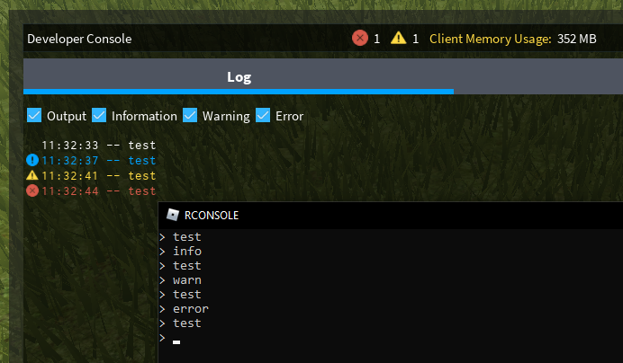

## > rconsole
A console-based exploit that prints to the in-game developer console in 4 different modes. 
Based on Vindict's version but updated to fix the `StartProcessException...` issue. 
 
 
 
RCONSOLE is a console based exploit for ROBLOX that only has one implemented function: printing to the developer console.  
All credits for methods used in this repository that are not mine goes to their rightful owners.  
This repository is for educational purposes only.  

## License
[CC-BY-NC-SA-4.0](https://raw.githubusercontent.com/tobynetizen/rbx-rconsole/refs/heads/master/LICENSE)
